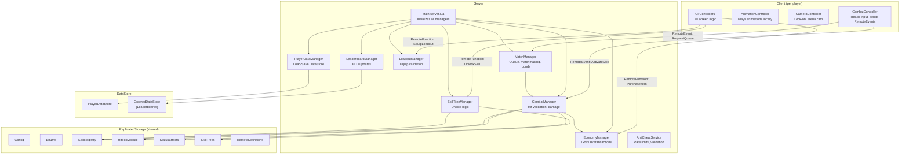
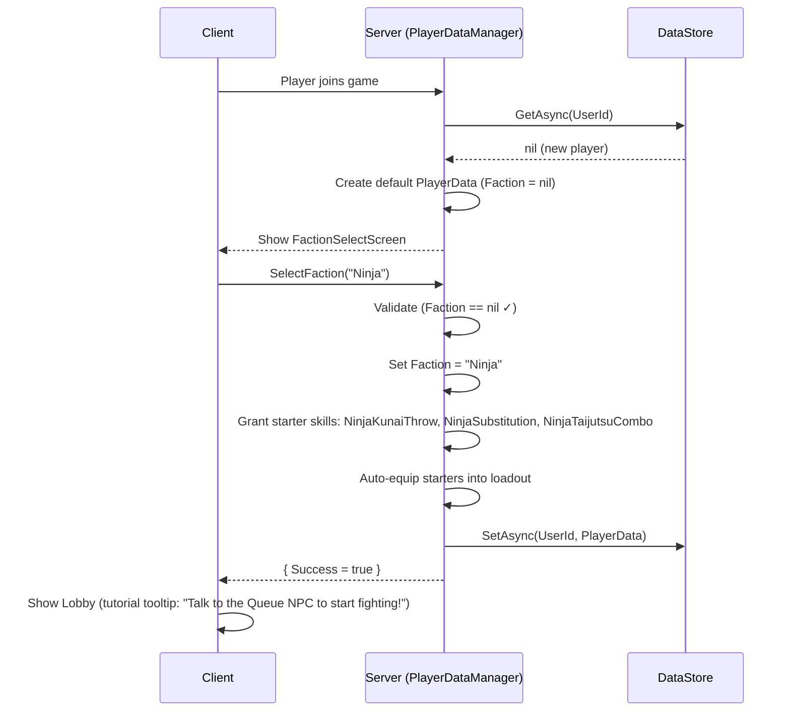
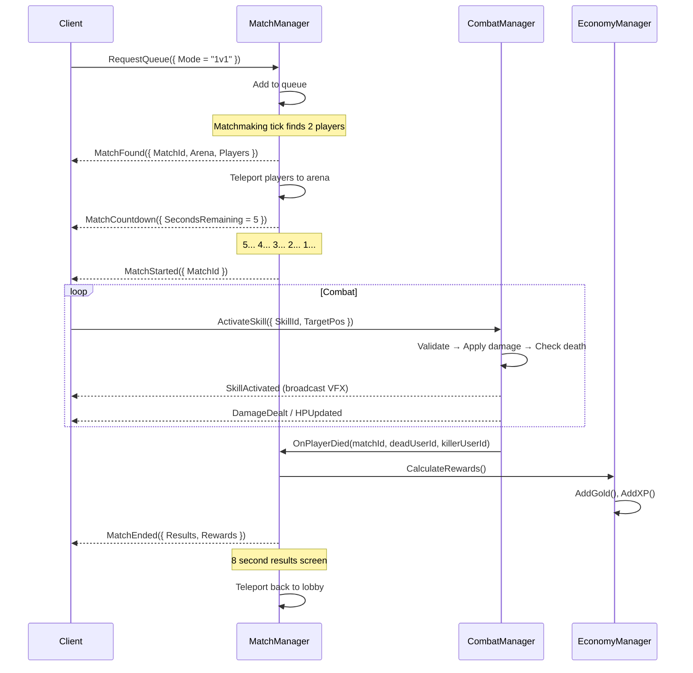
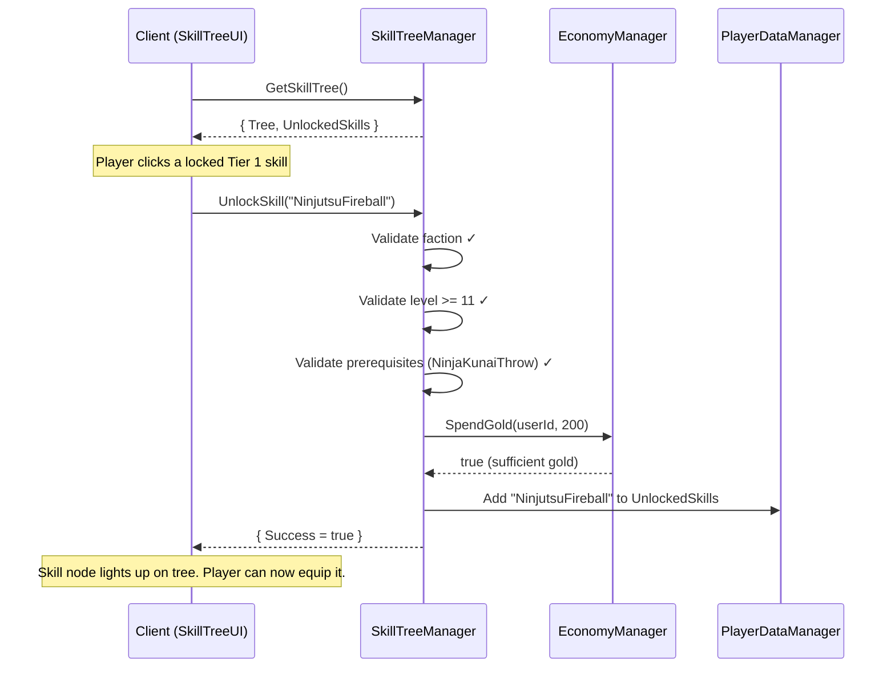
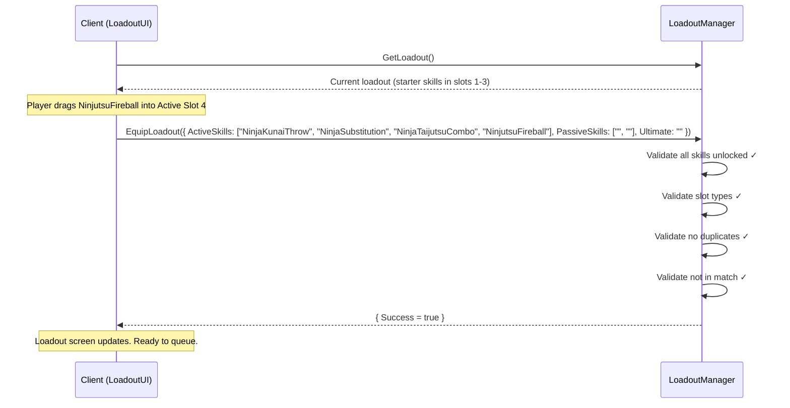
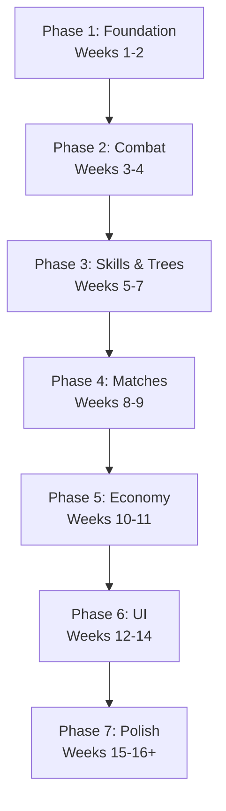

# J Force: Shattered Realms — Complete Requirements & System Architecture

> **Purpose**: This document is the single source of truth for building **J Force: Shattered Realms**, an anime arena PvP game on Roblox. It is written so that any developer or AI agent can read it and implement the full game without ambiguity. Every system, data structure, flow, formula, and edge case is defined here.

---

## Table of Contents

1. [Project Overview](#1-project-overview)
2. [Tech Stack & Constraints](#2-tech-stack--constraints)
3. [Project File Structure](#3-project-file-structure)
4. [Data Models](#4-data-models)
5. [System Architecture Overview](#5-system-architecture-overview)
6. [Module Specifications](#6-module-specifications)
7. [Player Flows](#7-player-flows)
8. [Combat System](#8-combat-system)
9. [Skill System](#9-skill-system)
10. [Faction & Skill Tree Definitions](#10-faction--skill-tree-definitions)
11. [Economy & Progression](#11-economy--progression)
12. [Arena & Match System](#12-arena--match-system)
13. [UI Screens](#13-ui-screens)
14. [Networking & Security](#14-networking--security)
15. [Data Persistence](#15-data-persistence)
16. [Configuration Constants](#16-configuration-constants)
17. [Error Handling](#17-error-handling)
18. [Implementation Order](#18-implementation-order)
19. [Testing Strategy](#19-testing-strategy)
20. [Skill Template (Adding New Skills)](#20-skill-template-adding-new-skills)

---

## 1. Project Overview

### 1.1 Game Concept

A **multiplayer PvP arena fighter** on Roblox set in the **Shattered Realms** — a fractured dimension where three worlds have collided. Players choose one of three anime-inspired factions (**Pirate**, **Shinigami**, **Ninja**), fight in arena matches to earn currency, and progressively unlock and equip skills from branching skill trees to create unique custom builds.

### 1.2 Core Pillars

| Pillar | Description |
|---|---|
| **Fight** | Fast-paced, skill-based PvP combat in enclosed arenas |
| **Earn** | Currency (Gold) and experience (XP) from every match |
| **Build** | Deep skill trees with branching paths per faction |
| **Customize** | Limited loadout slots force meaningful build choices |

### 1.3 Target Experience

- Match duration: **3–5 minutes** per round
- Player skill ceiling: **Medium-high** (easy to learn, hard to master)
- Session length: **15–30 minutes** (3–6 matches per session)
- Monetization: **Cosmetics only** (no pay-to-win)

---

## 2. Tech Stack & Constraints

| Component | Technology |
|---|---|
| **Engine** | Roblox Studio |
| **Language** | Luau (Roblox's Lua variant) |
| **Networking** | Roblox Client-Server model (RemoteEvents / RemoteFunctions) |
| **Data Persistence** | Roblox DataStoreService (ProfileService wrapper recommended) |
| **Physics** | Roblox physics engine (character movement), custom hitbox detection for combat |
| **UI Framework** | Roblox StarterGui + Roact (optional, for complex UI) |
| **Animation** | Roblox Animator / Moon Animator for custom skill animations |
| **VFX** | ParticleEmitters, Beams, custom meshes |

### 2.1 Roblox-Specific Constraints

- DataStore: Max 4MB per key, 60 requests/min per key, 6-second cooldown between writes to same key
- RemoteEvents: Keep payload under 1KB per fire. Do not trust client data.
- Server tick rate: ~60 Hz (Heartbeat). Combat validation must run server-side.
- Max players per server: Target **20 players** (lobby + matches)
- Place structure: Single place (no TeleportService for v1)

---

## 3. Project File Structure

```
game/
├── README.md                              -- This file
│
├── src/
│   ├── ServerScriptService/
│   │   ├── Main.server.lua                -- Server entry point, initializes all managers
│   │   ├── Managers/
│   │   │   ├── PlayerDataManager.lua      -- Load/save player data (DataStore)
│   │   │   ├── MatchManager.lua           -- Queue, matchmaking, round lifecycle
│   │   │   ├── CombatManager.lua          -- Server-side damage, hit validation
│   │   │   ├── SkillTreeManager.lua       -- Skill unlock logic, path validation
│   │   │   ├── EconomyManager.lua         -- Gold/XP rewards, purchases
│   │   │   ├── LoadoutManager.lua         -- Equip/unequip skill validation
│   │   │   └── LeaderboardManager.lua     -- ELO rating, rankings
│   │   └── Services/
│   │       ├── AntiCheatService.lua       -- Rate limiting, input validation
│   │       └── AnalyticsService.lua       -- Event logging for balancing
│   │
│   ├── ReplicatedStorage/
│   │   ├── Shared/
│   │   │   ├── Config.lua                 -- All balance constants (see Section 16)
│   │   │   ├── Enums.lua                  -- Faction, SkillTier, MatchState, etc.
│   │   │   ├── Types.lua                  -- Type definitions for all data models
│   │   │   └── Utils.lua                  -- Shared utility functions
│   │   ├── Combat/
│   │   │   ├── CombatConfig.lua           -- Damage formulas, hitbox sizes
│   │   │   ├── HitboxModule.lua           -- Spatial hitbox detection logic
│   │   │   └── StatusEffects.lua          -- Stun, burn, slow, etc. definitions
│   │   ├── Skills/
│   │   │   ├── SkillRegistry.lua          -- Master registry: maps SkillId → SkillModule
│   │   │   ├── SkillBase.lua              -- Base class all skills inherit from
│   │   │   ├── Pirate/
│   │   │   │   ├── PirateSwordSlash.lua
│   │   │   │   ├── PiratePistolShot.lua
│   │   │   │   ├── PirateDodgeRoll.lua
│   │   │   │   ├── SwordsmanDualWield.lua
│   │   │   │   ├── SwordsmanBladeStorm.lua
│   │   │   │   ├── SwordsmanAsuraSlash.lua
│   │   │   │   ├── DevilFruitFireFist.lua
│   │   │   │   ├── DevilFruitIceAge.lua
│   │   │   │   ├── DevilFruitAwakening.lua
│   │   │   │   ├── HakiArmorHarden.lua
│   │   │   │   ├── HakiObservation.lua
│   │   │   │   ├── HakiConqueror.lua
│   │   │   │   ├── TacticianTrap.lua
│   │   │   │   ├── TacticianWeatherStrike.lua
│   │   │   │   └── TacticianDebuff.lua
│   │   │   ├── Shinigami/
│   │   │   │   ├── ShinigamiSlash.lua
│   │   │   │   ├── ShinigamiFlashStep.lua
│   │   │   │   ├── ShinigamiKidoBlast.lua
│   │   │   │   ├── ZanpakutoShikai.lua
│   │   │   │   ├── ZanpakutoBankai.lua
│   │   │   │   ├── ZanpakutoFinalForm.lua
│   │   │   │   ├── KidoBinding.lua
│   │   │   │   ├── KidoDestruction.lua
│   │   │   │   ├── KidoBarrier.lua
│   │   │   │   ├── HollowMaskOn.lua
│   │   │   │   ├── HollowCero.lua
│   │   │   │   ├── HollowBerserker.lua
│   │   │   │   ├── HealerRestore.lua
│   │   │   │   ├── HealerShield.lua
│   │   │   │   └── HealerTeamBuff.lua
│   │   │   └── Ninja/
│   │   │       ├── NinjaKunaiThrow.lua
│   │   │       ├── NinjaSubstitution.lua
│   │   │       ├── NinjaTaijutsuCombo.lua
│   │   │       ├── NinjutsuFireball.lua
│   │   │       ├── NinjutsuWaterDragon.lua
│   │   │       ├── NinjutsuLightningBlade.lua
│   │   │       ├── TaijutsuGateOpen.lua
│   │   │       ├── TaijutsuComboChain.lua
│   │   │       ├── TaijutsuSpeedBurst.lua
│   │   │       ├── GenjutsuIllusion.lua
│   │   │       ├── GenjutsuSleep.lua
│   │   │       ├── GenjutsuFear.lua
│   │   │       ├── SageModeActivate.lua
│   │   │       ├── SageSummonToad.lua
│   │   │       └── SageNatureBlast.lua
│   │   ├── SkillTrees/
│   │   │   ├── PirateSkillTree.lua        -- Pirate tree definition (nodes, edges, costs)
│   │   │   ├── ShinigamiSkillTree.lua     -- Shinigami tree definition
│   │   │   └── NinjaSkillTree.lua         -- Ninja tree definition
│   │   └── Remotes/
│   │       └── RemoteDefinitions.lua      -- All RemoteEvent/Function declarations
│   │
│   ├── StarterGui/
│   │   ├── MainMenu/
│   │   │   ├── MainMenuController.lua
│   │   │   └── MainMenu.rbxm              -- UI layout
│   │   ├── FactionSelect/
│   │   │   ├── FactionSelectController.lua
│   │   │   └── FactionSelect.rbxm
│   │   ├── SkillTreeScreen/
│   │   │   ├── SkillTreeController.lua
│   │   │   └── SkillTreeScreen.rbxm
│   │   ├── LoadoutScreen/
│   │   │   ├── LoadoutController.lua
│   │   │   └── LoadoutScreen.rbxm
│   │   ├── ShopScreen/
│   │   │   ├── ShopController.lua
│   │   │   └── ShopScreen.rbxm
│   │   ├── MatchHUD/
│   │   │   ├── MatchHUDController.lua
│   │   │   └── MatchHUD.rbxm
│   │   └── ResultsScreen/
│   │       ├── ResultsController.lua
│   │       └── ResultsScreen.rbxm
│   │
│   ├── StarterPlayer/
│   │   └── StarterCharacterScripts/
│   │       ├── CombatController.local.lua -- Reads input → fires RemoteEvents
│   │       ├── AnimationController.local.lua
│   │       └── CameraController.local.lua -- Lock-on targeting, arena camera
│   │
│   └── Workspace/
│       ├── Lobby/                          -- Hub world with NPCs, portals
│       ├── Arenas/
│       │   ├── Arena_1v1_A/               -- Small enclosed arena
│       │   ├── Arena_1v1_B/               -- Variant map
│       │   ├── Arena_2v2/                 -- Medium arena
│       │   ├── Arena_FFA/                 -- Large arena, 4-6 players
│       │   └── Arena_FactionWar/          -- 3v3v3 large arena with 3 spawn zones
│       └── NPCs/
│           ├── QueueNPC/                  -- Interact to join match queue
│           ├── ShopNPC/                   -- Opens shop UI
│           └── SkillMasterNPC/            -- Opens skill tree UI
│
├── assets/
│   ├── models/                            -- Character models, arena props
│   ├── animations/                        -- Skill animations (.rbxm)
│   ├── sounds/                            -- SFX per skill, ambient, UI sounds
│   ├── particles/                         -- VFX particle presets
│   └── ui/                                -- UI icons, backgrounds, frames
│
└── tests/
    ├── CombatTests.lua
    ├── SkillTreeTests.lua
    ├── EconomyTests.lua
    ├── LoadoutTests.lua
    └── DataPersistenceTests.lua
```

---

## 4. Data Models

All data types used throughout the game. Every module references these exact structures.

### 4.1 PlayerData (persisted to DataStore)

```lua
-- This is the root object saved per player
PlayerData = {
    UserId           = number,          -- Roblox UserId
    DisplayName      = string,          -- cached display name
    CreatedAt        = number,          -- os.time() of first join

    -- Faction (immutable after selection)
    Faction          = string | nil,    -- "Pirate" | "Shinigami" | "Ninja" | nil (not yet chosen)

    -- Progression
    Level            = number,          -- 1–999, starts at 1
    CurrentXP        = number,          -- XP toward next level
    TotalXPEarned    = number,          -- lifetime XP (never decreases)

    -- Economy
    Gold             = number,          -- spendable currency, starts at 0
    TotalGoldEarned  = number,          -- lifetime gold earned
    PremiumGems      = number,          -- purchased via Robux, cosmetics only

    -- Skills
    UnlockedSkills   = { [string] = true },  -- set of SkillIds the player owns
    -- Example: { ["SwordsmanDualWield"] = true, ["HakiArmorHarden"] = true }

    -- Loadout
    Loadout = {
        ActiveSkills = { string, string, string, string },  -- exactly 4 SkillIds (or "" for empty)
        PassiveSkills = { string, string },                   -- exactly 2 SkillIds (or "")
        Ultimate = string,                                     -- 1 SkillId (or "")
    },

    -- Stats
    Stats = {
        MatchesPlayed   = number,
        MatchesWon      = number,
        TotalKills      = number,
        TotalDeaths     = number,
        TotalDamageDealt = number,
        WinStreak       = number,       -- current win streak
        BestWinStreak   = number,       -- all-time best
    },

    -- Ranking
    ELO              = number,          -- starts at 1000
    Rank             = string,          -- derived from ELO (see Section 11)

    -- Cosmetics
    OwnedCosmetics   = { [string] = true },  -- set of CosmeticIds
    EquippedCosmetics = {
        CharacterSkin  = string | nil,
        AuraEffect     = string | nil,
        VictoryEmote   = string | nil,
        Title          = string | nil,
    },

    -- Settings
    Settings = {
        MusicVolume     = number,       -- 0.0–1.0
        SFXVolume       = number,       -- 0.0–1.0
        ShowDamageNumbers = boolean,
        AutoQueue       = boolean,      -- auto re-queue after match
    },

    -- Metadata
    DataVersion      = number,          -- schema version for migrations
    LastSaveTime     = number,          -- os.time() of last save
}
```

### 4.2 SkillDefinition (static, defined in SkillModules)

```lua
SkillDefinition = {
    -- Identity
    Id              = string,           -- unique key, e.g. "SwordsmanDualWield"
    Name            = string,           -- display name, e.g. "Dual Wield"
    Description     = string,           -- tooltip text
    Icon            = string,           -- asset ID for UI icon
    Faction         = string,           -- "Pirate" | "Shinigami" | "Ninja"
    Path            = string,           -- "Swordsman" | "DevilFruit" | "Haki" | "Tactician" | etc.
    Tier            = number,           -- 1, 2, or 3

    -- Slot Type
    SlotType        = string,           -- "Active" | "Passive" | "Ultimate"

    -- Combat Properties (for Active/Ultimate skills)
    Damage          = number | nil,     -- base damage (nil for passives)
    Cooldown        = number,           -- seconds
    Range           = number | nil,     -- studs (nil = melee range = 8)
    CastTime        = number,           -- seconds before damage applies (0 = instant)
    Duration        = number | nil,     -- for buffs/DoTs, seconds
    HitboxShape     = string | nil,     -- "Sphere" | "Box" | "Cone" | "Line"
    HitboxSize      = Vector3 | nil,    -- dimensions of hitbox

    -- Passive Properties (for Passive skills)
    PassiveEffect   = {                 -- nil for Active/Ultimate skills
        Stat         = string,          -- "Speed" | "Defense" | "Attack" | "MaxHP" | "Lifesteal" | "CooldownReduction"
        Value        = number,          -- flat or percentage bonus
        IsPercentage = boolean,         -- true = multiplicative, false = additive
    } | nil,

    -- Status Effects Applied
    StatusEffects   = {                 -- list of effects applied on hit
        {
            Type     = string,          -- "Stun" | "Burn" | "Slow" | "Knockback" | "Silence" | "Fear" | "Sleep"
            Duration = number,          -- seconds
            Value    = number | nil,    -- damage per tick (Burn), slow % (Slow), force (Knockback)
        }
    } | nil,

    -- Unlock Requirements
    UnlockCost = {
        Gold         = number,          -- gold cost to unlock
        LevelRequired = number,         -- minimum player level
        Prerequisites = { string },     -- list of SkillIds that must be unlocked first
    },

    -- Animation & VFX
    AnimationId     = string,           -- Roblox animation asset ID
    VFXPrefab       = string | nil,     -- name of VFX prefab in assets/particles/
    SoundId         = string | nil,     -- Roblox sound asset ID
}
```

### 4.3 MatchState (server-side, in-memory only)

```lua
MatchState = {
    MatchId         = string,           -- unique GUID
    Mode            = string,           -- "1v1" | "2v2" | "FFA" | "FactionWar" | "BossRaid"
    ArenaName       = string,           -- e.g. "Arena_1v1_A"
    State           = string,           -- "Countdown" | "InProgress" | "Ending" | "Cleanup"
    StartTime       = number,           -- os.time() when match started
    TimeLimit       = number,           -- seconds (e.g. 180 for 3 min)
    TimeRemaining   = number,           -- updated each tick

    -- Players
    Players = {
        [UserId] = {
            UserId      = number,
            Faction     = string,
            Team        = number | nil,  -- team index (nil for FFA)
            Loadout     = Loadout,       -- snapshot of loadout at match start
            HP          = number,        -- current HP
            MaxHP       = number,        -- max HP (base + passives)
            Alive       = boolean,
            Kills       = number,        -- kills this match
            Deaths      = number,        -- deaths this match
            DamageDealt = number,        -- total damage dealt this match
            Cooldowns   = { [SkillId] = number },  -- remaining cooldown per skill
            ActiveStatusEffects = { StatusEffect },
            Position    = Vector3,       -- last validated position
        }
    },

    -- Round tracking (for multi-round modes)
    CurrentRound    = number,           -- 1-indexed
    MaxRounds       = number,           -- e.g. 3 for best-of-3
    RoundWins       = { [Team/UserId] = number },

    -- Results (populated when State == "Ending")
    Results = {
        Winner       = number | nil,    -- UserId or Team index
        MVP          = number | nil,    -- UserId of most damage/kills
        Rewards      = { [UserId] = { Gold = number, XP = number } },
    } | nil,
}
```

### 4.4 QueueEntry (server-side, in-memory)

```lua
QueueEntry = {
    UserId          = number,
    Faction         = string,
    ELO             = number,
    Mode            = string,           -- "1v1" | "2v2" | "FFA" | "FactionWar"
    QueuedAt        = number,           -- os.time()
    PartyMembers    = { number } | nil, -- other UserIds in party (2v2 only)
}
```

---

## 5. System Architecture Overview



### 5.1 Client → Server Communication (All RemoteEvents/Functions)

```lua
-- File: ReplicatedStorage/Remotes/RemoteDefinitions.lua
-- Every network call in the game is defined here. No other remotes exist.

Remotes = {
    -- ═══════════════════════════════════════
    -- COMBAT (RemoteEvents — fire and forget)
    -- ═══════════════════════════════════════
    ActivateSkill = RemoteEvent,
    -- Client → Server
    -- Payload: { SkillId = string, TargetPosition = Vector3?, TargetUserId = number? }
    -- Server validates cooldown, range, line of sight, then applies damage

    CancelSkill = RemoteEvent,
    -- Client → Server
    -- Payload: { SkillId = string }
    -- Cancel a channeled skill early

    -- Server → Client (broadcast to all players in match)
    SkillActivated = RemoteEvent,
    -- Payload: { CasterUserId = number, SkillId = string, Position = Vector3, Direction = Vector3 }
    -- Tells all clients to play animation/VFX

    DamageDealt = RemoteEvent,
    -- Server → Client
    -- Payload: { TargetUserId = number, Damage = number, IsCritical = boolean, SourceSkillId = string }

    PlayerDied = RemoteEvent,
    -- Server → Client
    -- Payload: { UserId = number, KillerUserId = number }

    StatusEffectApplied = RemoteEvent,
    -- Server → Client
    -- Payload: { TargetUserId = number, EffectType = string, Duration = number }

    HPUpdated = RemoteEvent,
    -- Server → Client
    -- Payload: { UserId = number, CurrentHP = number, MaxHP = number }

    -- ═══════════════════════════════════════
    -- MATCH (RemoteEvents)
    -- ═══════════════════════════════════════
    RequestQueue = RemoteEvent,
    -- Client → Server
    -- Payload: { Mode = string }  -- "1v1" | "2v2" | "FFA" | "FactionWar"

    LeaveQueue = RemoteEvent,
    -- Client → Server
    -- Payload: (none)

    MatchFound = RemoteEvent,
    -- Server → Client
    -- Payload: { MatchId = string, Mode = string, ArenaName = string, Players = {PlayerInfo} }

    MatchCountdown = RemoteEvent,
    -- Server → Client
    -- Payload: { SecondsRemaining = number }

    MatchStarted = RemoteEvent,
    -- Server → Client
    -- Payload: { MatchId = string }

    MatchEnded = RemoteEvent,
    -- Server → Client
    -- Payload: { MatchId = string, Results = MatchResults }

    RoundEnded = RemoteEvent,
    -- Server → Client
    -- Payload: { Round = number, WinnerTeam = number?, WinnerUserId = number? }

    TimerUpdate = RemoteEvent,
    -- Server → Client (every second)
    -- Payload: { TimeRemaining = number }

    -- ═══════════════════════════════════════
    -- SKILL TREE (RemoteFunctions — request/response)
    -- ═══════════════════════════════════════
    UnlockSkill = RemoteFunction,
    -- Client → Server → Client
    -- Request: { SkillId = string }
    -- Response: { Success = boolean, Error = string? }
    -- Server checks: level req, gold cost, prerequisites, faction match

    GetSkillTree = RemoteFunction,
    -- Client → Server → Client
    -- Request: (none — uses player's faction)
    -- Response: { Tree = SkillTreeDefinition, Unlocked = {SkillId = true} }

    -- ═══════════════════════════════════════
    -- LOADOUT (RemoteFunctions)
    -- ═══════════════════════════════════════
    EquipLoadout = RemoteFunction,
    -- Client → Server → Client
    -- Request: { ActiveSkills = {4 strings}, PassiveSkills = {2 strings}, Ultimate = string }
    -- Response: { Success = boolean, Error = string? }
    -- Server checks: all skills are unlocked, correct slot types, correct faction

    GetLoadout = RemoteFunction,
    -- Client → Server → Client
    -- Request: (none)
    -- Response: { Loadout = Loadout }

    -- ═══════════════════════════════════════
    -- ECONOMY (RemoteFunctions)
    -- ═══════════════════════════════════════
    GetPlayerData = RemoteFunction,
    -- Client → Server → Client
    -- Request: (none)
    -- Response: { PlayerData = PlayerData }  (sanitized, no internal fields)

    PurchaseCosmetic = RemoteFunction,
    -- Client → Server → Client
    -- Request: { CosmeticId = string }
    -- Response: { Success = boolean, Error = string? }

    -- ═══════════════════════════════════════
    -- FACTION (RemoteFunction)
    -- ═══════════════════════════════════════
    SelectFaction = RemoteFunction,
    -- Client → Server → Client
    -- Request: { Faction = string }  -- "Pirate" | "Shinigami" | "Ninja"
    -- Response: { Success = boolean, Error = string? }
    -- Server checks: player hasn't already chosen (Faction == nil)
    -- On success: grants starter skills, sets faction permanently
}
```

---

## 6. Module Specifications

### 6.1 PlayerDataManager

**Purpose**: Load, cache, save, and migrate player data.

```lua
-- Public API
PlayerDataManager.LoadPlayer(player: Player) → PlayerData
-- Called on PlayerAdded. Loads from DataStore, applies migrations, caches in memory.
-- If new player: creates default PlayerData with DataVersion = CURRENT_VERSION.

PlayerDataManager.SavePlayer(player: Player) → boolean
-- Saves cached data to DataStore. Called on PlayerRemoving and periodic auto-save.

PlayerDataManager.GetData(userId: number) → PlayerData | nil
-- Returns cached data. Returns nil if player not loaded yet.

PlayerDataManager.UpdateData(userId: number, key: string, value: any) → void
-- Updates a single field. Validates types. Marks cache dirty.

PlayerDataManager.AutoSaveLoop() → void
-- Runs every 120 seconds. Saves all dirty caches.

PlayerDataManager.OnPlayerRemoving(player: Player) → void
-- Final save. Remove from cache. Retry up to 3 times on failure.
```

**Migration system**: Each `DataVersion` bump has a migration function. When loading, if saved version < current version, run all migrations sequentially.

### 6.2 MatchManager

**Purpose**: Queue players, create matches, manage round lifecycle.

```lua
MatchManager.AddToQueue(userId: number, mode: string) → { Success: boolean, Error: string? }
-- Validates: player has faction, has loadout with at least 1 active skill, not already in queue/match.
-- Adds QueueEntry to mode-specific queue.

MatchManager.RemoveFromQueue(userId: number) → void

MatchManager.TickMatchmaking() → void
-- Called every 2 seconds by Heartbeat.
-- For each mode queue:
--   1v1: Pop 2 players with closest ELO (within ±200, expanding ±50 every 10 sec)
--   2v2: Pop 4 players (or 2 parties of 2)
--   FFA: Pop 4-6 players
--   FactionWar: Pop 9 players (3 per faction, or best effort 3v3v3)
-- When enough players found: CreateMatch()

MatchManager.CreateMatch(mode: string, playerIds: {number}, arenaName: string) → MatchState
-- 1. Teleport all players to arena spawn points
-- 2. Set MatchState to "Countdown"
-- 3. Fire MatchFound to all clients
-- 4. Start 5-second countdown
-- 5. Set state to "InProgress", fire MatchStarted
-- 6. Begin match timer

MatchManager.EndMatch(matchId: string) → void
-- 1. Determine winner (last alive / most kills / team with most round wins)
-- 2. Calculate rewards (see EconomyManager.CalculateRewards)
-- 3. Update ELO (see LeaderboardManager.UpdateELO)
-- 4. Fire MatchEnded to all clients
-- 5. Wait 8 seconds on results screen
-- 6. Teleport all players back to lobby
-- 7. Clean up MatchState

MatchManager.OnPlayerDied(matchId: string, userId: number, killerUserId: number) → void
-- Update kill/death counters. Check win condition.
-- 1v1: other player wins immediately
-- FFA: last alive wins
-- 2v2: team with all members dead loses
-- FactionWar: last faction with living members wins

MatchManager.GetActiveMatch(userId: number) → MatchState | nil
-- Returns the match a player is currently in, if any.
```

### 6.3 CombatManager

**Purpose**: Validate and apply all combat actions server-side.

```lua
CombatManager.OnSkillActivated(userId: number, skillId: string, targetPos: Vector3?, targetUserId: number?) → void
-- VALIDATION PIPELINE:
-- 1. Player is alive and in an active match
-- 2. Skill is in player's equipped loadout
-- 3. Skill is not on cooldown
-- 4. Player is not stunned/silenced
-- 5. If targeted: target is in range and alive
-- 6. If directional: targetPos is within max range
--
-- ON VALID:
-- 1. Put skill on cooldown
-- 2. If CastTime > 0: schedule damage after CastTime
-- 3. Compute hitbox at target position/direction
-- 4. Find all enemies in hitbox (HitboxModule.Query)
-- 5. For each hit enemy: ApplyDamage()
-- 6. Broadcast SkillActivated to all clients in match (for VFX/animation)
--
-- ON INVALID:
-- 1. Silently drop (do not tell client why — anti-cheat)

CombatManager.ApplyDamage(attackerId: number, targetId: number, baseDamage: number, skillId: string) → void
-- 1. Calculate final damage:
--    finalDamage = baseDamage * (1 + attacker.AttackBonus) * (1 - target.DefenseReduction)
--    Critical chance: 10% base, deals 1.5x damage
-- 2. Apply to target HP
-- 3. Apply any StatusEffects from the skill
-- 4. Fire DamageDealt to attacker client
-- 5. Fire HPUpdated to all clients in match
-- 6. If target HP <= 0: HandleDeath()

CombatManager.HandleDeath(matchId: string, userId: number, killerUserId: number) → void
-- 1. Set player Alive = false
-- 2. Fire PlayerDied to all clients
-- 3. Call MatchManager.OnPlayerDied to check win condition
-- 4. If respawn mode: schedule respawn after 5 seconds

CombatManager.TickStatusEffects(matchId: string, dt: number) → void
-- Called every Heartbeat. For each player, for each active status effect:
-- Burn: apply DPS damage
-- Slow: reduce WalkSpeed
-- Stun: prevent skill activation
-- Silence: prevent skill activation (but allow movement)
-- Fear: force random movement direction
-- Sleep: prevent all action (broken on damage)
-- Remove expired effects, restore original stats

CombatManager.RespawnPlayer(matchId: string, userId: number) → void
-- Reset HP to MaxHP, clear status effects, teleport to spawn point, set Alive = true
```

### 6.4 SkillTreeManager

```lua
SkillTreeManager.GetTree(faction: string) → SkillTreeDefinition
-- Returns the full tree structure for a faction (nodes, edges, costs)

SkillTreeManager.UnlockSkill(userId: number, skillId: string) → { Success: boolean, Error: string? }
-- VALIDATION:
-- 1. Skill exists in SkillRegistry
-- 2. Skill's faction matches player's faction
-- 3. Player level >= skill's LevelRequired
-- 4. Player gold >= skill's Gold cost
-- 5. All prerequisite skills are unlocked
-- 6. Skill not already unlocked
--
-- ON VALID:
-- 1. Deduct gold via EconomyManager.SpendGold
-- 2. Add SkillId to player's UnlockedSkills
-- 3. Save player data
-- 4. Return { Success = true }

SkillTreeManager.CanUnlock(userId: number, skillId: string) → { CanUnlock: boolean, Reason: string? }
-- Same validation as UnlockSkill but without spending. Used by UI to show lock/unlock state.

SkillTreeManager.GetUnlockedSkills(userId: number) → { [string]: true }
-- Returns set of unlocked skill IDs for a player.

SkillTreeManager.ResetTree(userId: number) → { Success: boolean, Error: string? }
-- Costs 500 Gold. Removes all unlocked skills except starter skills. Clears loadout.
```

### 6.5 EconomyManager

```lua
EconomyManager.AddGold(userId: number, amount: number, reason: string) → void
-- Add gold. reason is logged for analytics ("match_win", "match_loss", "daily_quest", etc.)

EconomyManager.SpendGold(userId: number, amount: number, reason: string) → boolean
-- Returns false if insufficient gold. Deducts and logs.

EconomyManager.AddXP(userId: number, amount: number) → { LeveledUp: boolean, NewLevel: number? }
-- Add XP. If XP >= XPForNextLevel(currentLevel), level up.
-- Can multi-level if enough XP.

EconomyManager.CalculateRewards(matchState: MatchState, userId: number) → { Gold: number, XP: number }
-- Formula (see Section 11 for exact values):
--   Base Gold: 50 (loss) / 100 (win)
--   Bonus Gold: +10 per kill, +5 per 1000 damage dealt
--   Streak Bonus: +20% per consecutive win (max 100%)
--   Base XP: 30 (loss) / 60 (win)
--   Bonus XP: +5 per kill, +3 per 1000 damage dealt

EconomyManager.GetBalance(userId: number) → { Gold: number, PremiumGems: number }
```

### 6.6 LoadoutManager

```lua
LoadoutManager.EquipLoadout(userId: number, loadout: Loadout) → { Success: boolean, Error: string? }
-- VALIDATION:
-- 1. All SkillIds in loadout are unlocked by this player
-- 2. ActiveSkills: exactly 4 slots (can be "" for empty), all must have SlotType == "Active"
-- 3. PassiveSkills: exactly 2 slots (can be ""), all must have SlotType == "Passive"
-- 4. Ultimate: exactly 1 slot (can be ""), must have SlotType == "Ultimate"
-- 5. All skills must belong to player's faction
-- 6. No duplicate SkillIds across all slots
-- 7. Player is NOT currently in a match (can't change loadout mid-fight)

LoadoutManager.GetLoadout(userId: number) → Loadout

LoadoutManager.AutoEquipStarters(userId: number, faction: string) → void
-- Called when faction is first selected. Equips the 3 starter skills into Active slots 1-3.
```

### 6.7 LeaderboardManager

```lua
LeaderboardManager.UpdateELO(winnerId: number, loserId: number) → { WinnerNewELO: number, LoserNewELO: number }
-- Standard ELO formula:
--   K = 32
--   expectedWin = 1 / (1 + 10^((loserELO - winnerELO) / 400))
--   winnerNewELO = winnerELO + K * (1 - expectedWin)
--   loserNewELO  = loserELO  + K * (0 - (1 - expectedWin))
--   Minimum ELO: 100 (can't drop below)

LeaderboardManager.GetRank(elo: number) → string
-- Returns rank name based on ELO bracket (see Section 11)

LeaderboardManager.GetTopPlayers(count: number) → { {UserId, ELO, Rank} }
-- Reads from OrderedDataStore. Cached for 60 seconds.
```

---

## 7. Player Flows

### 7.1 First-Time Player Flow



### 7.2 Match Lifecycle Flow



### 7.3 Skill Unlock Flow



### 7.4 Loadout Equip Flow



---

## 8. Combat System

### 8.1 Character Stats (Base Values)

All factions share the same base stats. Differences come from skills and passives only.

| Stat | Base Value | Notes |
|---|---|---|
| MaxHP | 1000 | Modified by passives |
| WalkSpeed | 20 | Roblox default = 16, slightly faster for action feel |
| JumpPower | 55 | Roblox default = 50 |
| AttackBonus | 0% | Additive from passives |
| DefenseReduction | 0% | Damage reduction from passives (cap at 50%) |
| CritChance | 10% | Can be increased by passives |
| CritMultiplier | 1.5x | Fixed |

### 8.2 Damage Formula

```
rawDamage = skill.Damage
attackMultiplier = 1 + attacker.AttackBonus
defenseMultiplier = 1 - min(target.DefenseReduction, 0.50)
isCrit = random() < attacker.CritChance
critMultiplier = isCrit ? 1.5 : 1.0

finalDamage = floor(rawDamage * attackMultiplier * defenseMultiplier * critMultiplier)
```

### 8.3 Hitbox Detection (HitboxModule)

```lua
HitboxModule.Query(origin: Vector3, direction: Vector3, shape: string, size: Vector3, ignoreUserId: number) → { HitPlayer }
-- Uses OverlapParams with a whitelist of player characters in the match.
-- Shape implementations:
--   "Sphere": Region3 centered at origin + direction * (size.X/2), radius = size.X
--   "Box": Region3 at origin, oriented along direction, dimensions = size
--   "Cone": Sphere query + angle check (within 45° of direction), radius = size.X
--   "Line": Raycast from origin along direction, max distance = size.X, radius = size.Y (thick ray)
```

### 8.4 Cooldown System

- Cooldowns are tracked **server-side** per player per skill in `MatchState.Players[userId].Cooldowns`
- When a skill is activated: `Cooldowns[skillId] = skill.Cooldown`
- Every Heartbeat: decrement all cooldowns by `dt`
- Skill activation rejected if `Cooldowns[skillId] > 0`
- Client shows cooldown UI locally (synced via SkillActivated remote)

### 8.5 Status Effect System

| Effect | Behavior | Stackable? | Max Duration |
|---|---|---|---|
| **Stun** | Cannot move or use skills | No (refresh duration) | 3 sec |
| **Silence** | Cannot use skills, can move | No (refresh) | 4 sec |
| **Slow** | WalkSpeed reduced by Value% | Yes (additive, cap 70%) | 5 sec |
| **Burn** | Takes Value damage per second | Yes (independent ticks) | 6 sec |
| **Knockback** | Impulse force = Value in direction | N/A (instant) | N/A |
| **Fear** | Forced to run in random direction, no skills | No (refresh) | 3 sec |
| **Sleep** | Cannot act. Broken immediately on taking damage | No (refresh) | 5 sec |

### 8.6 Respawn Rules (per mode)

| Mode | Respawn? | Respawn Time | Lives |
|---|---|---|---|
| 1v1 | No | N/A | 1 (round-based, best of 3) |
| 2v2 | Yes | 5 seconds | Unlimited (timed match) |
| FFA | No | N/A | 1 life |
| Faction War | Yes | 8 seconds | Unlimited (timed match) |
| Boss Raid | Yes | 10 seconds | 3 lives |

---

## 9. Skill System

### 9.1 SkillBase (Abstract Base Module)

Every skill module inherits from SkillBase and overrides methods as needed.

```lua
-- ReplicatedStorage/Skills/SkillBase.lua
local SkillBase = {}
SkillBase.__index = SkillBase

function SkillBase.new(definition: SkillDefinition)
    local self = setmetatable({}, SkillBase)
    self.Definition = definition
    return self
end

-- Override in subclass for custom activation logic
function SkillBase:OnActivate(caster: Player, targetPos: Vector3?, targetPlayer: Player?)
    -- Default: create hitbox, deal damage, apply effects
    local hits = HitboxModule.Query(
        caster.Character.HumanoidRootPart.Position,
        caster.Character.HumanoidRootPart.CFrame.LookVector,
        self.Definition.HitboxShape,
        self.Definition.HitboxSize,
        caster.UserId
    )
    for _, hitPlayer in hits do
        CombatManager.ApplyDamage(
            caster.UserId,
            hitPlayer.UserId,
            self.Definition.Damage,
            self.Definition.Id
        )
    end
end

-- Override for channeled/multi-phase skills
function SkillBase:OnCastStart(caster: Player) end
function SkillBase:OnCastComplete(caster: Player) end
function SkillBase:OnCastCancel(caster: Player) end

-- Override for skills with custom VFX beyond the default
function SkillBase:GetVFXData() → { AnimationId, VFXPrefab, SoundId }
    return {
        AnimationId = self.Definition.AnimationId,
        VFXPrefab = self.Definition.VFXPrefab,
        SoundId = self.Definition.SoundId,
    }
end

return SkillBase
```

### 9.2 SkillRegistry

```lua
-- ReplicatedStorage/Skills/SkillRegistry.lua
-- Auto-populated on require. Maps SkillId → SkillModule instance.

local SkillRegistry = {}

-- Populated at startup by iterating all modules in Skills/Pirate/, Skills/Shinigami/, Skills/Ninja/
SkillRegistry.Skills = {}  -- { [SkillId] = SkillModuleInstance }

function SkillRegistry.Get(skillId: string) → SkillModule | nil
function SkillRegistry.GetAllForFaction(faction: string) → { SkillModule }
function SkillRegistry.GetAllForPath(faction: string, path: string) → { SkillModule }
```

---

## 10. Faction & Skill Tree Definitions

### 10.1 Skill Tree Data Format

Each faction's skill tree is a table of nodes and edges. This is the data format that `SkillTreeUI` renders and `SkillTreeManager` validates against.

```lua
-- Example: ReplicatedStorage/SkillTrees/NinjaSkillTree.lua
return {
    Faction = "Ninja",
    StarterSkills = { "NinjaKunaiThrow", "NinjaSubstitution", "NinjaTaijutsuCombo" },

    Paths = {
        {
            PathId = "Ninjutsu",
            PathName = "Ninjutsu Master",
            Description = "Elemental jutsu: fire, water, lightning",
            Color = Color3.fromRGB(255, 100, 0),  -- orange, for UI
            Tiers = {
                { -- Tier 1
                    LevelRequired = 11,
                    Skills = { "NinjutsuFireball", "NinjutsuWaterDragon", "NinjutsuLightningBlade" },
                    -- Player can unlock any/all of these once they meet the level req
                },
                { -- Tier 2
                    LevelRequired = 30,
                    Skills = { "NinjutsuGrandFireball", "NinjutsuTidalWave", "NinjutsuChidori" },
                    PrerequisiteCount = 1, -- must have at least 1 Tier 1 skill from this path
                },
                { -- Tier 3 (Ultimate)
                    LevelRequired = 70,
                    Skills = { "NinjutsuSusanoo" },
                    PrerequisiteCount = 2, -- must have at least 2 Tier 2 skills from this path
                },
            },
        },
        {
            PathId = "Taijutsu",
            PathName = "Taijutsu Specialist",
            Description = "Physical combat, gate openings, speed",
            Color = Color3.fromRGB(0, 200, 0),
            Tiers = {
                {
                    LevelRequired = 11,
                    Skills = { "TaijutsuGateOpen", "TaijutsuComboChain", "TaijutsuSpeedBurst" },
                },
                {
                    LevelRequired = 30,
                    Skills = { "TaijutsuGate3", "TaijutsuBarrage", "TaijutsuDynamicEntry" },
                    PrerequisiteCount = 1,
                },
                {
                    LevelRequired = 70,
                    Skills = { "TaijutsuGate8NightGuy" },
                    PrerequisiteCount = 2,
                },
            },
        },
        {
            PathId = "Genjutsu",
            PathName = "Genjutsu User",
            Description = "Illusions, confusion, crowd control",
            Color = Color3.fromRGB(150, 0, 200),
            Tiers = {
                {
                    LevelRequired = 11,
                    Skills = { "GenjutsuIllusion", "GenjutsuSleep", "GenjutsuFear" },
                },
                {
                    LevelRequired = 30,
                    Skills = { "GenjutsuMirrorWorld", "GenjutsuNightmare", "GenjutsuParalyze" },
                    PrerequisiteCount = 1,
                },
                {
                    LevelRequired = 70,
                    Skills = { "GenjutsuTsukuyomi" },
                    PrerequisiteCount = 2,
                },
            },
        },
        {
            PathId = "Sage",
            PathName = "Sage / Summoner",
            Description = "Nature energy, summons, transformation",
            Color = Color3.fromRGB(0, 150, 255),
            Tiers = {
                {
                    LevelRequired = 11,
                    Skills = { "SageModeActivate", "SageSummonToad", "SageNatureBlast" },
                },
                {
                    LevelRequired = 30,
                    Skills = { "SagePerfectMode", "SageSummonGamabunta", "SageRasenShuriken" },
                    PrerequisiteCount = 1,
                },
                {
                    LevelRequired = 70,
                    Skills = { "SageSixPathsMode" },
                    PrerequisiteCount = 2,
                },
            },
        },
    },
}
```

### 10.2 Complete Skill List (All Factions)

#### 🏴‍☠️ PIRATE FACTION

| SkillId | Name | Path | Tier | SlotType | Damage | Cooldown | Range | Cost (Gold) | Level Req |
|---|---|---|---|---|---|---|---|---|---|
| PirateSwordSlash | Sword Slash | Starter | 0 | Active | 80 | 1.5s | 8 | Free | 1 |
| PiratePistolShot | Pistol Shot | Starter | 0 | Active | 60 | 3s | 40 | Free | 1 |
| PirateDodgeRoll | Dodge Roll | Starter | 0 | Active | 0 | 4s | - | Free | 1 |
| SwordsmanDualWield | Dual Wield | Swordsman | 1 | Active | 120 | 5s | 10 | 200 | 11 |
| SwordsmanBladeStorm | Blade Storm | Swordsman | 2 | Active | 200 | 12s | 15 | 600 | 30 |
| SwordsmanAsuraSlash | Asura Slash | Swordsman | 3 | Ultimate | 450 | 45s | 12 | 2000 | 70 |
| DevilFruitFireFist | Fire Fist | DevilFruit | 1 | Active | 100 | 6s | 30 | 200 | 11 |
| DevilFruitIceAge | Ice Age | DevilFruit | 1 | Active | 90 | 7s | 25 | 200 | 11 |
| DevilFruitAwakening | Awakening | DevilFruit | 2 | Active | 250 | 15s | 20 | 600 | 30 |
| DevilFruitGravityCrush | Gravity Crush | DevilFruit | 3 | Ultimate | 500 | 50s | 35 | 2000 | 70 |
| HakiArmorHarden | Armor Harden | Haki | 1 | Passive | - | - | - | 200 | 11 |
| HakiObservation | Observation | Haki | 1 | Passive | - | - | - | 200 | 11 |
| HakiConqueror | Conqueror's Haki | Haki | 2 | Active | 0 (stun) | 20s | 20 | 600 | 30 |
| HakiSupremeKing | Supreme King | Haki | 3 | Ultimate | 300 | 40s | 30 | 2000 | 70 |
| TacticianTrap | Trap Setup | Tactician | 1 | Active | 80 | 8s | 30 | 200 | 11 |
| TacticianWeatherStrike | Weather Strike | Tactician | 2 | Active | 180 | 10s | 35 | 600 | 30 |
| TacticianDebuff | Weakening Aura | Tactician | 1 | Passive | - | - | - | 200 | 11 |
| TacticianCommandField | Command Field | Tactician | 3 | Ultimate | 0 (buff) | 45s | 25 | 2000 | 70 |

#### ⚔️ SHINIGAMI FACTION

| SkillId | Name | Path | Tier | SlotType | Damage | Cooldown | Range | Cost (Gold) | Level Req |
|---|---|---|---|---|---|---|---|---|---|
| ShinigamiSlash | Zanpakuto Slash | Starter | 0 | Active | 85 | 1.5s | 8 | Free | 1 |
| ShinigamiFlashStep | Flash Step | Starter | 0 | Active | 0 | 3s | 30 | Free | 1 |
| ShinigamiKidoBlast | Kido Blast | Starter | 0 | Active | 55 | 4s | 35 | Free | 1 |
| ZanpakutoShikai | Shikai Release | Zanpakuto | 1 | Active | 130 | 8s | 12 | 200 | 11 |
| ZanpakutoBankai | Bankai | Zanpakuto | 2 | Active | 280 | 20s | 15 | 600 | 30 |
| ZanpakutoFinalForm | Final Zanpakuto | Zanpakuto | 3 | Ultimate | 500 | 50s | 20 | 2000 | 70 |
| KidoBinding | Bakudo Bind | Kido | 1 | Active | 0 (stun) | 10s | 25 | 200 | 11 |
| KidoDestruction | Hado Blast | Kido | 1 | Active | 110 | 6s | 35 | 200 | 11 |
| KidoBarrier | Danku Barrier | Kido | 2 | Active | 0 (shield) | 15s | - | 600 | 30 |
| KidoUltimate | Hado 99 | Kido | 3 | Ultimate | 480 | 45s | 40 | 2000 | 70 |
| HollowMaskOn | Hollow Mask | Hollow | 1 | Active | 0 (buff) | 15s | - | 200 | 11 |
| HollowCero | Cero | Hollow | 1 | Active | 140 | 8s | 40 | 200 | 11 |
| HollowBerserker | Berserker Mode | Hollow | 2 | Active | 0 (buff) | 25s | - | 600 | 30 |
| HollowResurrection | Resurrection | Hollow | 3 | Ultimate | 350 | 45s | 15 | 2000 | 70 |
| HealerRestore | Healing Light | Healer | 1 | Active | -150 (heal) | 8s | 20 | 200 | 11 |
| HealerShield | Energy Shield | Healer | 2 | Active | 0 (shield) | 12s | 15 | 600 | 30 |
| HealerTeamBuff | Team Blessing | Healer | 1 | Passive | - | - | - | 200 | 11 |
| HealerUltimate | Divine Restoration | Healer | 3 | Ultimate | -500 (AoE heal) | 50s | 25 | 2000 | 70 |

#### 🍥 NINJA FACTION

| SkillId | Name | Path | Tier | SlotType | Damage | Cooldown | Range | Cost (Gold) | Level Req |
|---|---|---|---|---|---|---|---|---|---|
| NinjaKunaiThrow | Kunai Throw | Starter | 0 | Active | 50 | 2s | 35 | Free | 1 |
| NinjaSubstitution | Substitution | Starter | 0 | Active | 0 | 6s | - | Free | 1 |
| NinjaTaijutsuCombo | Basic Combo | Starter | 0 | Active | 75 | 1.5s | 8 | Free | 1 |
| NinjutsuFireball | Fireball Jutsu | Ninjutsu | 1 | Active | 110 | 6s | 30 | 200 | 11 |
| NinjutsuWaterDragon | Water Dragon | Ninjutsu | 1 | Active | 130 | 8s | 25 | 200 | 11 |
| NinjutsuLightningBlade | Lightning Blade | Ninjutsu | 1 | Active | 100 | 5s | 12 | 200 | 11 |
| NinjutsuGrandFireball | Grand Fireball | Ninjutsu | 2 | Active | 220 | 12s | 35 | 600 | 30 |
| NinjutsuChidori | Chidori | Ninjutsu | 2 | Active | 260 | 14s | 10 | 600 | 30 |
| NinjutsuSusanoo | Susanoo | Ninjutsu | 3 | Ultimate | 500 | 50s | 25 | 2000 | 70 |
| TaijutsuGateOpen | Gate of Opening | Taijutsu | 1 | Active | 0 (buff) | 12s | - | 200 | 11 |
| TaijutsuComboChain | Combo Chain | Taijutsu | 1 | Active | 90 x3 | 7s | 8 | 200 | 11 |
| TaijutsuSpeedBurst | Speed Burst | Taijutsu | 1 | Passive | - | - | - | 200 | 11 |
| TaijutsuGate3 | Gate of Life | Taijutsu | 2 | Active | 0 (buff) | 20s | - | 600 | 30 |
| TaijutsuBarrage | Barrage | Taijutsu | 2 | Active | 50 x8 | 10s | 8 | 600 | 30 |
| TaijutsuGate8NightGuy | Night Guy | Taijutsu | 3 | Ultimate | 600 | 55s | 10 | 2000 | 70 |
| GenjutsuIllusion | Illusion | Genjutsu | 1 | Active | 0 (confuse) | 10s | 20 | 200 | 11 |
| GenjutsuSleep | Sleep | Genjutsu | 1 | Active | 0 (sleep) | 12s | 25 | 200 | 11 |
| GenjutsuFear | Fear | Genjutsu | 1 | Active | 0 (fear) | 10s | 20 | 200 | 11 |
| GenjutsuMirrorWorld | Mirror Dimension | Genjutsu | 2 | Active | 150 | 15s | 15 | 600 | 30 |
| GenjutsuTsukuyomi | Tsukuyomi | Genjutsu | 3 | Ultimate | 400 | 50s | 15 | 2000 | 70 |
| SageModeActivate | Sage Mode | Sage | 1 | Active | 0 (buff) | 20s | - | 200 | 11 |
| SageSummonToad | Summon Toad | Sage | 1 | Active | 120 | 10s | 20 | 200 | 11 |
| SageNatureBlast | Nature Blast | Sage | 1 | Active | 100 | 7s | 30 | 200 | 11 |
| SagePerfectMode | Perfect Sage | Sage | 2 | Active | 0 (buff) | 30s | - | 600 | 30 |
| SageRasenShuriken | Rasen Shuriken | Sage | 2 | Active | 280 | 15s | 30 | 600 | 30 |
| SageSixPathsMode | Six Paths Sage | Sage | 3 | Ultimate | 550 | 55s | 30 | 2000 | 70 |

---

## 11. Economy & Progression

### 11.1 XP Table (Level → XP Required)

```lua
function XPForLevel(level: number) → number
    return math.floor(100 * (level ^ 1.5))
end
-- Level 1→2:   100 XP
-- Level 10→11:  316 XP
-- Level 25→26:  1250 XP
-- Level 50→51:  3536 XP
-- Level 75→76:  6495 XP
-- Level 99→100: 9850 XP
```

### 11.2 Match Reward Formulas

```lua
function CalculateRewards(matchState, userId) → { Gold: number, XP: number }
    local player = matchState.Players[userId]
    local won = (matchState.Results.Winner == userId) or (matchState.Results.Winner == player.Team)

    -- Base rewards
    local gold = won and 100 or 50
    local xp   = won and 60  or 30

    -- Kill bonus
    gold = gold + (player.Kills * 10)
    xp   = xp   + (player.Kills * 5)

    -- Damage bonus (per 1000 damage)
    gold = gold + math.floor(player.DamageDealt / 1000) * 5
    xp   = xp   + math.floor(player.DamageDealt / 1000) * 3

    -- Win streak bonus (current streak, applied to gold only)
    local streakMultiplier = 1 + math.min(playerData.Stats.WinStreak * 0.2, 1.0)
    if won then
        gold = math.floor(gold * streakMultiplier)
    end

    return { Gold = gold, XP = xp }
end
```

### 11.3 ELO Brackets → Rank Names

| ELO Range | Rank | Icon |
|---|---|---|
| 0–799 | Bronze | 🥉 |
| 800–1099 | Silver | 🥈 |
| 1100–1399 | Gold | 🥇 |
| 1400–1699 | Platinum | 💎 |
| 1700–1999 | Diamond | 💠 |
| 2000–2299 | Master | ⭐ |
| 2300+ | Legend | 👑 |

### 11.4 Skill Cost Scaling

| Tier | Gold Cost | Level Required | Typical Unlock Time |
|---|---|---|---|
| Starter | Free | 1 | Immediate |
| Tier 1 | 200 | 11 | ~2 hours of play |
| Tier 2 | 600 | 30 | ~8 hours of play |
| Tier 3 (Ultimate) | 2000 | 70 | ~30 hours of play |

### 11.5 Cosmetic Pricing (Premium Gems via Robux)

| Item Type | Gem Cost | Robux Equivalent |
|---|---|---|
| Character Skin | 500 | ~\$6.25 |
| Aura Effect | 300 | ~\$3.75 |
| Victory Emote | 200 | ~\$2.50 |
| Title | 100 | ~\$1.25 |

Gem packages: 100 = 80R\$, 500 = 350R\$ (10% bonus), 1000 = 650R\$ (20% bonus)

---

## 12. Arena & Match System

### 12.1 Arena Specifications

| Arena | Size (studs) | Max Players | Spawn Points | Features |
|---|---|---|---|---|
| Arena_1v1_A | 80 × 80 | 2 | 2 (opposite ends) | Flat, no cover, basic |
| Arena_1v1_B | 100 × 100 | 2 | 2 | Pillars for cover, elevated center |
| Arena_2v2 | 120 × 120 | 4 | 4 (2 per side) | Team spawn areas, central fighting zone |
| Arena_FFA | 150 × 150 | 6 | 6 (spread around edges) | Multiple levels, cover objects |
| Arena_FactionWar | 200 × 200 | 9 | 9 (3 per corner, triangle layout) | 3 faction zones, central capture point |

### 12.2 Match Settings per Mode

| Setting | 1v1 | 2v2 | FFA | Faction War | Boss Raid |
|---|---|---|---|---|---|
| Time Limit | 180s | 240s | 180s | 300s | 600s |
| Rounds | Best of 3 | 1 | 1 | 1 | 1 |
| Respawn | No | Yes (5s) | No | Yes (8s) | Yes (10s, 3 lives) |
| Win Condition | Last alive | Most kills | Last alive | Most kills (team) | Boss HP = 0 |
| ELO Affected | Yes | Yes | No | No | No |

### 12.3 Matchmaking Rules

```
1. Player enters queue for a specific mode
2. Every 2 seconds, TickMatchmaking() runs:
   a. Sort queue by QueuedAt (FIFO)
   b. For 1v1: find 2 players within ELO tolerance
      - Start tolerance: ±200 ELO
      - Expand by ±50 every 10 seconds in queue
      - Max tolerance: ±500 (after 60s in queue, match anyone)
   c. For 2v2: find 4 players or 2 pre-made parties
   d. For FFA: pop first 4–6 players (no ELO restriction)
   e. For FactionWar: need at least 2 per faction (6 min), ideally 3 per faction (9)
3. When match is formed, remove players from queue and create match
```

---

## 13. UI Screens

### 13.1 Screen List & Triggers

| Screen | When Shown | Key Elements |
|---|---|---|
| **FactionSelect** | First time player only (Faction == nil) | 3 large faction cards with preview model, lore text, confirm button |
| **MainMenu / Lobby HUD** | Always visible in lobby | Gold/XP/Level display, minimap, quick-queue buttons |
| **QueuePopup** | While in queue | Mode name, time in queue, cancel button, ELO range display |
| **MatchHUD** | During match | HP bar (self + enemy), skill cooldown icons (4 + Ultimate), timer, kill feed, score |
| **SkillTreeScreen** | Opened via NPC or button | Full tree visualization per faction, node states (locked/unlockable/unlocked), cost display, unlock button |
| **LoadoutScreen** | Opened via NPC or button | 8 slots (4 active + 2 passive + 1 ultimate + basic attack), drag-and-drop from unlocked skills list |
| **ShopScreen** | Opened via NPC or button | Tabs: Cosmetics, Gem Packs. Item cards with preview, price, purchase button |
| **ResultsScreen** | After match ends (8 seconds) | Winner announcement, MVP, stats table (kills/deaths/damage per player), rewards earned (Gold, XP), level-up animation if applicable, "Play Again" button |
| **SettingsScreen** | Gear icon in lobby | Volume sliders, toggle damage numbers, toggle auto-queue |

### 13.2 SkillTreeScreen — Node States

Each node on the skill tree has one of these visual states:

| State | Visual | Condition |
|---|---|---|
| **Locked** | Greyed out, lock icon | Prerequisites not met OR level too low |
| **Unlockable** | Glowing border, price shown | All prereqs met, level sufficient, has enough gold |
| **Affordable but Level-Locked** | Dim glow, "Level X required" | Has gold, has prereqs, but level too low |
| **Unlocked** | Full color, checkmark | Player owns this skill |
| **Equipped** | Full color + equipped badge | Skill is in current loadout |

### 13.3 MatchHUD Layout

```
┌──────────────────────────────────────────────────┐
│  [Enemy HP Bar]                    Timer: 2:45    │
│                                    Score: 1-0     │
│                                                   │
│                                                   │
│                 (3D Arena View)                    │
│                                                   │
│                                                   │
│  [Kill Feed]                                      │
│  "PlayerA eliminated PlayerB"                     │
│                                                   │
│  [Self HP Bar: ████████░░ 800/1000]               │
│  [Q] Fireball  [E] Substitution  [R] Combo  [F] Water Dragon │
│   Ready         3.2s              Ready      5.1s             │
│  [G] ULTIMATE: Susanoo — Ready                    │
└──────────────────────────────────────────────────┘
```

---

## 14. Networking & Security

### 14.1 Client-Server Responsibility Split

| Action | Client Does | Server Does |
|---|---|---|
| Skill activation | Sends `ActivateSkill(SkillId, TargetPos)` | Validates cooldown, range, state → applies damage |
| Movement | Standard Roblox character movement (client-authoritative) | Periodic position sanity checks (anti-teleport) |
| HP display | Renders HP from server updates | Is the source of truth for all HP values |
| Cooldown display | Shows local timer (started when SkillActivated received) | Tracks authoritative cooldowns, rejects early activations |
| Loadout change | Sends `EquipLoadout(newLoadout)` | Validates ownership, slot types, saves |
| Skill unlock | Sends `UnlockSkill(SkillId)` | Validates requirements, deducts gold, grants skill |
| Damage numbers | Renders floating text from DamageDealt event | Calculates all damage |

### 14.2 Anti-Cheat Measures

```lua
-- AntiCheatService.lua

-- Rate Limiting
MAX_SKILL_ACTIVATIONS_PER_SECOND = 5
-- If client sends more than 5 ActivateSkill events per second → kick

-- Position Validation (runs every 1 second)
MAX_SPEED = 60 -- studs/sec (WalkSpeed 20 * 3 for dashes)
-- If player moved more than MAX_SPEED * timeDelta → teleport back to last valid position

-- Damage Validation
-- All damage is server-calculated. Client never tells server how much damage to deal.

-- Cooldown Validation
-- Server tracks cooldowns. Client-sent activations during cooldown are silently dropped.

-- DataStore Validation
-- All economy transactions go through EconomyManager. No direct DataStore writes from client.
```

---

## 15. Data Persistence

### 15.1 DataStore Keys

```lua
-- PlayerDataStore (regular DataStore)
Key format: "JForceShatteredRealms_PlayerData_" .. tostring(userId)
Value: JSON-encoded PlayerData table
Scope: Default

-- LeaderboardStore (OrderedDataStore)
Key format: tostring(userId)
Value: ELO (number)
Scope: "GlobalELO"
```

### 15.2 Save Strategy

```
1. On PlayerAdded:
   - GetAsync("PlayerData_" .. userId)
   - If nil: create default PlayerData
   - If exists: deserialize, run migrations if DataVersion < CURRENT_VERSION
   - Cache in memory (ServerStorage or module table)

2. Auto-save every 120 seconds:
   - Loop through all cached PlayerData
   - If dirty (modified since last save): SetAsync
   - Mark clean after successful save

3. On PlayerRemoving:
   - Immediate SetAsync (with pcall + retry up to 3 times)
   - Remove from cache

4. On game:BindToClose (server shutting down):
   - Save ALL cached players
   - 30 second grace period
```

### 15.3 Data Migration Example

```lua
local CURRENT_DATA_VERSION = 2

local Migrations = {
    [1] = function(data)
        -- v1 → v2: Added Settings table
        data.Settings = {
            MusicVolume = 0.5,
            SFXVolume = 0.8,
            ShowDamageNumbers = true,
            AutoQueue = false,
        }
        data.DataVersion = 2
        return data
    end,
}

function MigrateData(data)
    while data.DataVersion < CURRENT_DATA_VERSION do
        local migrator = Migrations[data.DataVersion]
        if migrator then
            data = migrator(data)
        else
            warn("Missing migration for version " .. data.DataVersion)
            break
        end
    end
    return data
end
```

---

## 16. Configuration Constants

```lua
-- ReplicatedStorage/Shared/Config.lua
-- ALL tunable values in one place. No magic numbers anywhere else.

return {
    -- ═══ COMBAT ═══
    BASE_HP = 1000,
    BASE_WALK_SPEED = 20,
    BASE_JUMP_POWER = 55,
    BASE_CRIT_CHANCE = 0.10,
    CRIT_MULTIPLIER = 1.5,
    MAX_DEFENSE_REDUCTION = 0.50,
    MELEE_RANGE = 8,   -- studs

    -- ═══ MATCH ═══
    COUNTDOWN_DURATION = 5,       -- seconds before match starts
    RESULTS_SCREEN_DURATION = 8,  -- seconds to show results
    MATCHMAKING_TICK_INTERVAL = 2, -- seconds between matchmaking attempts
    INITIAL_ELO_TOLERANCE = 200,
    ELO_TOLERANCE_EXPAND_RATE = 50,  -- per 10 seconds in queue
    MAX_ELO_TOLERANCE = 500,

    -- ═══ RESPAWN ═══
    RESPAWN_TIME_2V2 = 5,
    RESPAWN_TIME_FACTION_WAR = 8,
    RESPAWN_TIME_BOSS_RAID = 10,
    BOSS_RAID_LIVES = 3,

    -- ═══ ECONOMY ═══
    GOLD_WIN = 100,
    GOLD_LOSS = 50,
    GOLD_PER_KILL = 10,
    GOLD_PER_1000_DAMAGE = 5,
    XP_WIN = 60,
    XP_LOSS = 30,
    XP_PER_KILL = 5,
    XP_PER_1000_DAMAGE = 3,
    WIN_STREAK_BONUS_PER_WIN = 0.20, -- 20% per consecutive win
    WIN_STREAK_BONUS_CAP = 1.00,     -- 100% max bonus
    SKILL_RESET_COST = 500,

    -- ═══ PROGRESSION ═══
    XP_FORMULA_BASE = 100,
    XP_FORMULA_EXPONENT = 1.5,
    -- XPForLevel(n) = floor(100 * n^1.5)

    -- ═══ ELO ═══
    STARTING_ELO = 1000,
    ELO_K_FACTOR = 32,
    MINIMUM_ELO = 100,

    -- ═══ TIMING ═══
    AUTO_SAVE_INTERVAL = 120,       -- seconds
    DATA_SAVE_RETRIES = 3,
    BIND_TO_CLOSE_TIMEOUT = 30,     -- seconds

    -- ═══ ANTI-CHEAT ═══
    MAX_SKILL_FIRES_PER_SECOND = 5,
    MAX_MOVEMENT_SPEED = 60,        -- studs/sec (accounts for dashes)
    POSITION_CHECK_INTERVAL = 1,    -- seconds

    -- ═══ ARENA SIZES ═══
    ARENA_SIZES = {
        ["Arena_1v1_A"]      = Vector3.new(80, 50, 80),
        ["Arena_1v1_B"]      = Vector3.new(100, 50, 100),
        ["Arena_2v2"]        = Vector3.new(120, 50, 120),
        ["Arena_FFA"]        = Vector3.new(150, 50, 150),
        ["Arena_FactionWar"] = Vector3.new(200, 50, 200),
    },

    -- ═══ MATCH SETTINGS ═══
    MATCH_TIME_LIMITS = {
        ["1v1"]        = 180,
        ["2v2"]        = 240,
        ["FFA"]        = 180,
        ["FactionWar"] = 300,
        ["BossRaid"]   = 600,
    },
    MATCH_ROUNDS = {
        ["1v1"] = 3,  -- best of 3
        -- all others = 1
    },
}
```

---

## 17. Error Handling

### 17.1 DataStore Errors

```lua
-- All DataStore calls wrapped in pcall with exponential backoff retry
function SafeDataStoreCall(func, maxRetries)
    for attempt = 1, maxRetries do
        local success, result = pcall(func)
        if success then return result end
        if attempt < maxRetries then
            task.wait(2 ^ attempt)  -- 2, 4, 8 seconds
        else
            warn("DataStore failed after " .. maxRetries .. " retries: " .. tostring(result))
            return nil, result
        end
    end
end
```

### 17.2 Remote Validation Pattern

```lua
-- Every RemoteFunction handler follows this pattern:
RemoteFunction.OnServerInvoke = function(player, request)
    -- 1. Type check all fields
    if typeof(request) ~= "table" then return { Success = false, Error = "Invalid request" } end
    if typeof(request.SkillId) ~= "string" then return { Success = false, Error = "Invalid SkillId" } end

    -- 2. Sanitize (clamp values, strip unexpected fields)
    -- 3. Validate game logic
    -- 4. Perform action
    -- 5. Return result

    -- NEVER expose internal error details to client
end
```

### 17.3 Match Error Recovery

```
- If a player disconnects during a match:
  → Mark them as dead, count as a loss for them
  → Match continues for remaining players
  → Disconnected player gets loss rewards (50 Gold, 30 XP) — no punishment beyond lost ELO

- If server crashes during match (game:BindToClose):
  → Save all player data (no match rewards given — data integrity over fairness)

- If a player's data fails to load:
  → Player cannot queue for matches
  → Show error UI: "Data failed to load. Please rejoin."
  → Retry load every 30 seconds automatically
```

---

## 18. Implementation Order

Build in this exact order. Each phase depends on the previous phase working correctly.



### Phase 1: Foundation (Weeks 1–2)
1. `Config.lua` — All constants
2. `Enums.lua` — All enumerations
3. `Types.lua` — Type definitions
4. `RemoteDefinitions.lua` — All remote declarations
5. `PlayerDataManager.lua` — Load, save, cache, migrate
6. `Main.server.lua` — Bootstrap, PlayerAdded/Removing hooks
7. **Test**: Join game → data loads → leave → data persists → rejoin → data intact

### Phase 2: Combat Core (Weeks 3–4)
1. `HitboxModule.lua` — All 4 hitbox shapes
2. `StatusEffects.lua` — All 7 status effect types
3. `SkillBase.lua` — Base class
4. `CombatManager.lua` — Activation validation, damage formula, death handling
5. `CombatController.local.lua` — Input reading, remote firing
6. `AnimationController.local.lua` — Play animations from server events
7. 3 starter skills for ONE faction (Ninja recommended — simplest to prototype)
8. **Test**: 2 players in a test arena → can attack each other → damage applies → one dies

### Phase 3: Skills & Trees (Weeks 5–7)
1. `SkillRegistry.lua` — Auto-discovery of skill modules
2. All Ninja skill modules (Tier 1–3, all 4 paths)
3. `NinjaSkillTree.lua` — Tree definition
4. `SkillTreeManager.lua` — Unlock logic
5. `LoadoutManager.lua` — Equip validation
6. All Pirate skill modules + tree
7. All Shinigami skill modules + tree
8. **Test**: Unlock a Tier 1 skill → equip it → use in combat → works correctly

### Phase 4: Match System (Weeks 8–9)
1. Build Arena_1v1_A map in Workspace
2. `MatchManager.lua` — Queue, matchmaking, round lifecycle
3. Spawn point logic, teleport to/from arena
4. Win condition detection
5. Results calculation
6. Build remaining arena maps
7. **Test**: 2 players queue → match created → fight → winner determined → back to lobby

### Phase 5: Economy (Weeks 10–11)
1. `EconomyManager.lua` — Gold/XP transactions, reward formulas
2. `LeaderboardManager.lua` — ELO calculations, OrderedDataStore
3. Faction selection flow (SelectFaction remote + starter skill granting)
4. Wire rewards into MatchManager.EndMatch
5. **Test**: Win match → earn gold → level up → unlock skill → gold deducted → skill usable

### Phase 6: UI (Weeks 12–14)
1. FactionSelectScreen (first-time flow)
2. MatchHUD (HP, cooldowns, timer, kill feed)
3. ResultsScreen (winner, stats, rewards)
4. SkillTreeScreen (interactive tree, unlock flow)
5. LoadoutScreen (drag-and-drop equip)
6. Lobby HUD (gold, level, quick-queue)
7. ShopScreen (cosmetics only for v1)
8. SettingsScreen
9. **Test**: Full player journey from first join → faction select → first match → unlock → equip → second match

### Phase 7: Polish & Launch (Weeks 15–16+)
1. VFX for all skills (particles, beams)
2. Sound effects
3. Camera system (lock-on targeting)
4. Anti-cheat hardening
5. Balance pass (adjust all damage/cooldown values based on playtesting)
6. Performance optimization (reduce RemoteEvent frequency, pool objects)
7. Loading screen, game icon, description, thumbnails
8. **Test**: Full playtest with 10+ players, fix bugs, balance, polish

---

## 19. Testing Strategy

### 19.1 Unit Tests (per module)

```lua
-- tests/CombatTests.lua
-- Run in Roblox Studio command bar or TestEZ framework

-- Test: Damage formula correctness
assert(CalculateDamage(100, 0.0, 0.0, false) == 100)   -- no bonuses
assert(CalculateDamage(100, 0.2, 0.0, false) == 120)   -- 20% attack bonus
assert(CalculateDamage(100, 0.0, 0.3, false) == 70)    -- 30% defense
assert(CalculateDamage(100, 0.0, 0.0, true) == 150)    -- critical hit
assert(CalculateDamage(100, 0.0, 0.6, false) == 50)    -- defense capped at 50%

-- Test: Cooldown enforcement
-- Activate skill → immediately try again → should be rejected

-- Test: Status effect expiry
-- Apply 3-second stun → after 3 seconds → player can act again
```

### 19.2 Integration Tests

| Test | Steps | Expected Result |
|---|---|---|
| Full match flow | Queue 2 players → match starts → one kills other → match ends | Winner gets rewards, loser gets reduced rewards, both return to lobby |
| Skill unlock chain | Level to 11 → unlock Tier 1 → level to 30 → unlock Tier 2 | Each unlock succeeds, gold deducted, skill usable |
| Loadout validation | Try to equip unowned skill | Rejected with error |
| Data persistence | Earn gold → leave → rejoin | Gold persists |
| Disconnect handling | Player disconnects mid-match | Match continues, disconnected player gets loss |

### 19.3 Balance Testing Metrics

Track these during playtesting to identify balance issues:

| Metric | Healthy Range | Action if Out of Range |
|---|---|---|
| Average match duration | 2–4 minutes | Adjust HP / damage globally |
| Win rate per faction | 45–55% | Nerf overperforming faction's skills |
| Most picked skills | No single skill > 40% pick rate | Buff alternatives or nerf dominant skill |
| Skill usage → kill conversion | Each skill has a reasonable kill rate | Adjust damage/cooldown of outliers |
| Player retention (day 1 → day 7) | > 20% | Improve onboarding, reward pacing |

---

## 20. Skill Template (Adding New Skills)

When adding a new skill, follow this exact template:

```lua
-- File: ReplicatedStorage/Skills/{Faction}/{SkillId}.lua
local SkillBase = require(game.ReplicatedStorage.Skills.SkillBase)
local HitboxModule = require(game.ReplicatedStorage.Combat.HitboxModule)

local SkillName = SkillBase.new({
    -- ═══ IDENTITY ═══
    Id              = "UniqueSkillId",
    Name            = "Display Name",
    Description     = "What this skill does, shown in UI tooltip.",
    Icon            = "rbxassetid://1234567890",
    Faction         = "Pirate",        -- "Pirate" | "Shinigami" | "Ninja"
    Path            = "Swordsman",     -- Path within faction
    Tier            = 1,               -- 1, 2, or 3

    -- ═══ SLOT TYPE ═══
    SlotType        = "Active",        -- "Active" | "Passive" | "Ultimate"

    -- ═══ COMBAT ═══
    Damage          = 120,
    Cooldown        = 6,               -- seconds
    Range           = 12,              -- studs (nil = melee = 8)
    CastTime        = 0.3,            -- seconds (0 = instant)
    Duration        = nil,             -- for buffs/DoTs (nil = instant)
    HitboxShape     = "Sphere",        -- "Sphere" | "Box" | "Cone" | "Line"
    HitboxSize      = Vector3.new(12, 12, 12),

    -- ═══ STATUS EFFECTS ═══
    StatusEffects   = {
        { Type = "Slow", Duration = 2, Value = 30 },  -- 30% slow for 2 sec
    },

    -- ═══ UNLOCK REQUIREMENTS ═══
    UnlockCost = {
        Gold            = 200,
        LevelRequired   = 11,
        Prerequisites   = { "PirateSwordSlash" },  -- must own these first
    },

    -- ═══ PRESENTATION ═══
    AnimationId     = "rbxassetid://0987654321",
    VFXPrefab       = "SwordsmanDualWieldVFX",     -- name in assets/particles/
    SoundId         = "rbxassetid://1122334455",
})

-- Override activation if custom behavior is needed
function SkillName:OnActivate(caster, targetPos, targetPlayer)
    -- Custom logic here, or call SkillBase default:
    SkillBase.OnActivate(self, caster, targetPos, targetPlayer)
end

return SkillName
```

### Checklist for adding a new skill:

- [ ] Create skill module file in correct faction folder
- [ ] Add SkillId to the faction's SkillTree definition (correct Path, correct Tier)
- [ ] Create/assign animation asset
- [ ] Create/assign VFX prefab
- [ ] Create/assign sound effect
- [ ] Create/assign UI icon
- [ ] Add to the complete skill table in this document (Section 10.2)
- [ ] Test: unlock → equip → use in arena → damage/effects apply correctly
- [ ] Balance: compare DPS (Damage/Cooldown) to other skills of same tier

---

> **End of specification. This document contains everything needed to build the complete game. Start with Phase 1 and proceed sequentially.**
